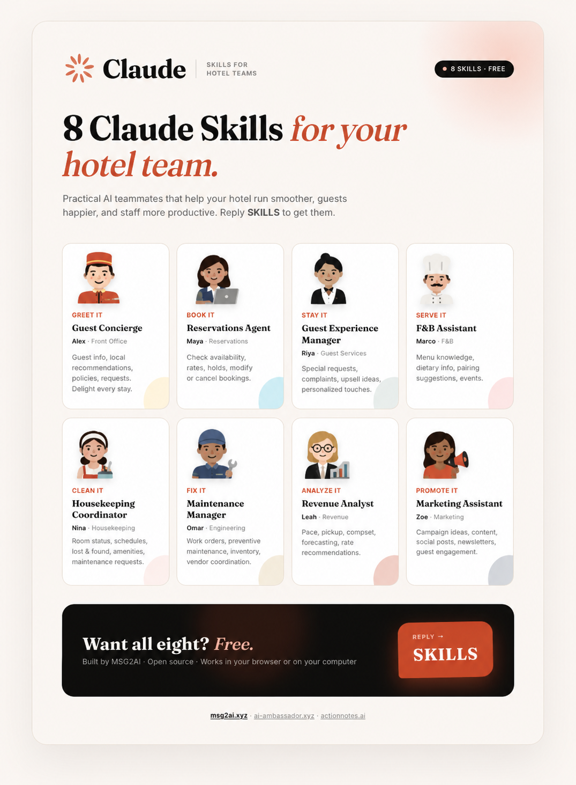

# Hotel Team Skills for Claude

**8 free Claude skills — one for every seat in your independent or small-chain hotel, plus a vibe coder to ship the direct-booking site.**

Built by [MSG2AI](https://msg2ai.xyz) · AI Ambassador for hotel guests · ActionNotes for leadership meetings



---

## What this is

Every independent and small-chain hotel (50–300 keys) runs on the same 8 roles — a GM, a Director of Rooms, a Revenue Manager, a Controller, an F&B Director, a Housekeeping/Rooms leader, a Director of Sales & Marketing, and (increasingly) someone technical to ship the website. Most of these hotels cover all eight roles with 4–6 people. These Claude skills give each role its own AI counterpart — trained on what that role actually does in a hotel, wired into the systems you already use (your PMS, RMS, channel manager, POS, Gmail, Google Drive), and fluent in the language of hotel economics (ADR, RevPAR, GOPPAR, TRevPAR, flow-through, USALI).

Install one skill or all eight. Each is self-contained. They share one **knowledge base** and one **property JSON** so they work together without you coordinating them.

> **New here?** Skim [`mock/`](./mock/) for a fully worked example — a fictional 174-key Nashville hotel with 3 sample outputs per skill.

---

## The 8 Skills

| Skill | Role | Persona | Key Capabilities |
|---|---|---|---|
| [`hotel-general-manager`](./hotel-general-manager/) | General Manager / Director of Operations | **Elena** | Daily flash report, weekly ops review, USALI owner report, risk register, capex, asset-manager briefing |
| [`hotel-front-office`](./hotel-front-office/) | Director of Rooms / Front Office | **Marcus** | Arrivals briefing, reservations triage, room blocking, walk strategy, upsells, concierge, rooming lists |
| [`hotel-revenue-management`](./hotel-revenue-management/) | Revenue Manager | **Priya** | BAR ladder, restrictions (MLOS/CTA/CTD), weekly pickup & pace, comp-set/STR, channel mix, group displacement |
| [`hotel-finance-controller`](./hotel-finance-controller/) | Controller / Director of Finance | **David** | Daily revenue audit, monthly USALI P&L, OTA reconciliation, AR/AP, payroll allocation, tax filings, cash flow |
| [`hotel-food-beverage`](./hotel-food-beverage/) | Director of Food & Beverage | **Sofia** | BEOs, covers forecast, menu engineering, beverage/pour cost, banquet RevPASF, F&B P&L flash |
| [`hotel-housekeeping-rooms`](./hotel-housekeeping-rooms/) | Director of Housekeeping / Rooms Division | **Grace** | Daily turnover sheet, inspection rubric, linen/supply pars, deep-clean rotation, work orders, PM calendar |
| [`hotel-sales-marketing`](./hotel-sales-marketing/) | Director of Sales & Marketing | **Tomás** | Group pipeline, RFP responses, marketing calendar, direct-booking strategy, OTA listing optimization, PR |
| [`hotel-vibe-coder`](./hotel-vibe-coder/) | Director of Digital / Vibe Coder | **Noor** | Hotel website, per-package landing pages, booking-engine integration, owner portal, press kit — ships to Vercel |

---

## First step for every skill: a shared Knowledge Base

Every skill reads from — and writes to — one **shared Knowledge Base** for your property. Set this up first. It can live anywhere your team already keeps documents:

- **Google Drive** folder (most common)
- **Dropbox** / OneDrive / SharePoint / Box folder
- **Notion** workspace / database
- Local folder synced to any of the above

The skills expect this canonical structure (the General Manager skill creates it for you if you don't have one):

```
hotel-knowledge-base/
├── 01-property-brief/        ← hotel name, # keys, positioning, ownership
├── 02-brand-and-voice/       ← logos, colors, photography, tone, signature moments
├── 03-rooms-inventory/       ← room types, attributes, rate codes, suite plans
├── 04-channels-distribution/ ← OTAs, GDS, brand.com, direct, wholesale, group blocks
├── 05-rate-strategy/         ← BAR ladder, packages, corporate, group blocks, restrictions
├── 06-rooms-housekeeping/    ← turnover SOPs, deep-clean cadence, linen & supply pars
├── 07-fnb/                   ← outlets, BEOs, menu engineering, beverage, banquet
├── 08-finance-accounting/    ← USALI chart of accounts, DRA, AR/AP, payroll
├── 09-guests/                ← segments, loyalty, profiles, complaints, NPS, reviews
└── 10-msg2ai-export/         ← merged property.json for hello.msg2ai.xyz
```

### Bootstrap from your hotel website (Firecrawl)

If you already have a hotel website, you don't need to fill the Knowledge Base by hand. The GM skill uses **Firecrawl** to crawl your site and extract structured information — room types, amenities, F&B outlets, location, photo URLs, brand voice, FAQs — and seed `01-property-brief/from-website.md`, `03-rooms-inventory/`, and `07-fnb/`.

---

## Prerequisites

Before installing, you need **one** of the following:

| Method | What you need | Best for |
|---|---|---|
| npx (Option 1) | Node.js 18+ | Quickest install — one command |
| Plugin (Option 2) | Git + Claude Code | Namespaced, managed via `/plugin` |
| Git clone (Option 3) | Git + Claude Code CLI | Full control, developer setup |
| Claude.ai Projects (Option 4) | A Claude.ai account | Non-technical users, no install |

---

## Installation

### Option 1 — One command with npx (easiest)

```bash
npx hotel-team-skills install
```

The installer clones the skills into `~/.claude/skills/hotel-team-skills/` and they're immediately available in Claude Code.

```bash
npx hotel-team-skills list        # See all 8 skills
npx hotel-team-skills update      # Update to the latest version
npx hotel-team-skills uninstall   # Remove the skills
```

### Option 2 — Claude Code Plugin

```bash
claude --plugin-dir /path/to/hotel-team-skills
```

Or clone first:

```bash
git clone https://github.com/msg2ai/hotel-team-skills.git
claude --plugin-dir ./hotel-team-skills
```

### Option 3 — Git clone (manual)

```bash
git clone https://github.com/msg2ai/hotel-team-skills.git ~/.claude/skills/hotel-team-skills
```

### Option 4 — Claude.ai Projects (no install)

1. Go to [claude.ai](https://claude.ai), create a Project named after your hotel
2. Open any `SKILL.md` file in this repo, click **Raw**, copy everything
3. Paste into the project's "Project instructions" and save
4. Start chatting — the skill is now active in that project

---

## Example prompts that "just work"

| When you say… | The skill that activates | What you get back |
|---|---|---|
| "Run today's daily flash report for the 9am standup" | General Manager | A one-pager: yesterday's Occ/ADR/RevPAR, today's arrivals/VIPs, risks, 3 decisions for you |
| "Block rooms for the group and pre-block the rooming list" | Front Office | A validated rooming list, pre-blocked rooms, key packets prepped, billing routing clear |
| "Score the displacement on a 110-room block next month" | Revenue Management | Displaced transient vs. group contribution — accept, adjust, or decline with the math |
| "Build the BAR ladder for the next 30 days" | Revenue Management | A segmented BAR ladder + MLOS/CTA restrictions for compression nights |
| "Generate the August USALI P&L close" | Finance & Controller | A USALI-format P&L, actual vs. budget vs. STLY, one-page exec summary |
| "Reconcile last month's Booking.com and Expedia payouts" | Finance & Controller | Per-OTA reconciliation, commission check, variances surfaced |
| "Build the BEO for the Saturday banquet for 420" | Food & Beverage | A complete banquet event order: guarantee, menu, set, AV, service, billing |
| "Schedule today's turnovers — flag same-day-flip risk" | Housekeeping & Rooms | Today's turnover sheet with RA credits assigned and risk-flagged rooms |
| "Respond to this corporate group RFP" | Sales & Marketing | A tailored 48-hour RFP response with availability, rate logic, F&B options |
| "Ship the /weddings landing page to Vercel" | Vibe Coder | A live Vercel preview URL with package content, gallery, and planner CTA |

**Skills also work together.** When you ask the GM for the monthly asset-manager briefing, it pulls pace from Revenue, sales pipeline from Sales, ops health from Rooms / F&B / Housekeeping, and the financial flash from the Controller — you don't coordinate, they share the knowledge base and the property JSON.

---

## Repository structure

```
hotel-team-skills/
├── README.md
├── LICENSE                                  ← MIT
├── CLAUDE.md                                ← guidance for Claude Code in this repo
├── package.json                             ← npm package config
├── bin/cli.js                               ← npx installer
├── .claude-plugin/plugin.json               ← Claude Code plugin manifest
├── docs/                                    ← supplementary docs
├── mock/                                    ← worked example: The Meridian Nashville (174 keys)
│   ├── property-portfolio.md
│   ├── README.md
│   └── outputs/                             ← 3 sample artifacts per skill (24 total)
├── hotel-general-manager/SKILL.md
├── hotel-front-office/SKILL.md
├── hotel-revenue-management/SKILL.md
├── hotel-finance-controller/SKILL.md
├── hotel-food-beverage/SKILL.md
├── hotel-housekeeping-rooms/SKILL.md
├── hotel-sales-marketing/SKILL.md
└── hotel-vibe-coder/SKILL.md
```

---

## About MSG2AI & related projects

Building AI infrastructure for hotels, vacation rentals, events, and B2B operations.

- **[msg2ai.xyz](https://msg2ai.xyz)** — MSG2AI, the parent company
- **[AI Ambassador](https://ai-ambassador.xyz)** — SMS/WhatsApp guest concierge
- **[ActionNotes](https://actionnotes.ai)** — AI-powered session and meeting capture
- **[Conference Team Skills](https://github.com/msg2ai/conference-team-skills)** — sister project: 8 Claude skills for conference organizing teams
- **[Vacation Rental Team Skills](https://github.com/msg2ai/vacationrental-team-skills)** — sister project: 8 Claude skills for vacation-rental management offices
- **Contact:** [bart@msg2ai.xyz](mailto:bart@msg2ai.xyz)

---

## License

MIT — free to use, modify, and redistribute. Attribution appreciated but not required.
